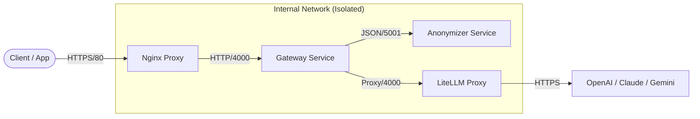

# 🛡️ LLM Shield — DevSecOps AI Gateway

A secure, privacy-first proxy for LLM APIs that **anonymizes sensitive data (PII, secrets)** before forwarding requests to external AI providers (OpenAI, Anthropic, Google).

Built with a **Defense-in-Depth** approach using modern DevSecOps practices.

## 🏗️ Architecture



## 🔒 Security Features (DevSecOps)

This project implements strict security controls:

### 1. Minimal Attack Surface (Distroless)
- **Base Image**: `gcr.io/distroless/python3-debian12`
- **No Shell**: `/bin/sh` or `/bin/bash` are stripped. RCE attacks cannot execute commands.
- **Non-Root**: All services run as user `65532` (nonroot).

### 2. Hardened Runtime
- **Read-Only Filesystem**: Services cannot modify their own code or system files (`read_only: true`).
- **Cap Drop ALL**: All Linux capabilities dropped.
- **No New Privileges**: Privilege escalation blocked.
- **Resource Limits**: CPU (0.5-1.0) and RAM (256-512MB) caps to prevent DoS.

### 3. Network Isolation
- **Private Backend**: Only Nginx (Port 80) is exposed.
- **Internal Only**: Gateway (4000) and Anonymizer (5001) are unreachable from outside.

### 4. Data Protection (Fail-Safe)
- **PII Redaction**: Emails, French phones, Names.
- **Secret Redaction**: API Keys (OpenAI, AWS, GitHub), Private Keys, Certificates, Passwords.
- **Fail-Safe**: If the Anonymizer is down or fails, the Gateway **BLOCKS** the request. No raw data leaks.

## 🚀 Quick Start

### Prerequisites
- Docker & Docker Compose
- API Key(s) for OpenAI, Anthropic, or Google

### Setup

1. **Configure Environment**
   ```bash
   cp .env.example .env
   # Edit .env and add your API keys
   nano .env
   ```

2. **Start Services**
   ```bash
   docker compose up -d
   ```

3. **Verify Health**
   ```bash
   curl http://localhost/health
   # {"status":"healthy","service":"gateway","anonymizer":"ok"}
   ```

## 🧪 Testing Anonymization

Send a request with sensitive data to verify protection:

```bash
curl -X POST http://localhost/v1/chat/completions \
  -H "Content-Type: application/json" \
  -d '{
    "model": "gpt-3.5-turbo",
    "messages": [{"role": "user", "content": "My email is test@example.com and my SDK key is sk-12345abcdef"}]
  }'
```

**Check the logs for proof:**
```bash
docker compose logs gateway --tail 10
```
Expected output:
> 🔒 Anonymized: My email is {{EMAIL}} and my SDK key is {{OPENAI_KEY}}...

### 5. Custom Patterns & Hot Reload

You can add your own regex patterns in `anonymizer/patterns.json`.
The file is mounted as a volume, allowing **Hot Reload** without restarting containers.

**How to reload patterns:**
```bash
# 1. Edit anonymizer/patterns.json
# 2. Trigger reload
network=$(docker compose ps -q anonymizer | xargs docker inspect --format '{{range $k,$v := .NetworkSettings.Networks}}{{$k}}{{end}}')
docker run --rm --network $network curlimages/curl -X POST http://anonymizer:5001/management/reload
```

## 🛠️ Development

### Project Structure
- `gateway/`: Python Flask proxy (Distroless)
- `anonymizer/`: PII/Secret detection engine (Distroless, Scrubadub + Regex)
- `anonymizer/patterns.json`: Externalized regex patterns
- `nginx/`: Secure entrypoint configuration
- `docker-compose.yml`: Production-ready composition

### Local Testing
```bash
# Run unit tests
pip install pytest
pytest gateway/test_app.py
pytest anonymizer/test_app.py
```

## 📜 License
MIT
